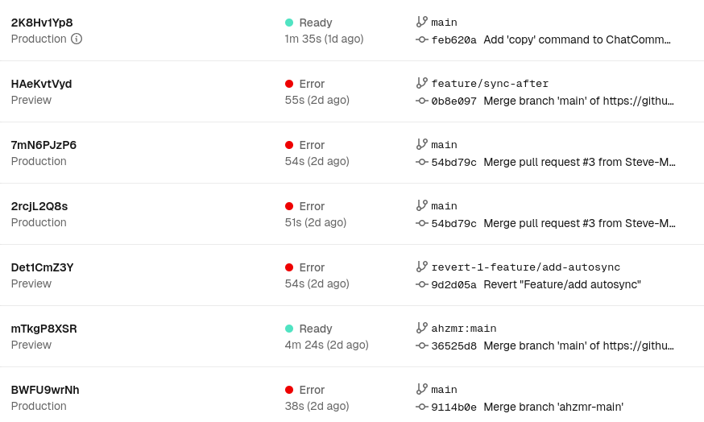

首先，儿童节快乐！  
其次，AI！AI！AI！  
最后，我们所做的努力，没有全部木大。  

<!--more-->

## 需求

虽然到目前为止我感觉用起来最顺手的还是 ChatGPT，托群友的福用上的 Gemini ~~Advanced~~ Pro 也能满足几乎所有需求，但是仍然有网络环境不是很顺畅的时候。  

而 DeepSeek/豆包等等其他服务在使用中难免有些前端的过滤规则不让我用，正好有朋友在玩火山提供的 DeepSeek API，一来二去打算自己搭一个服务来用。  

## 可选解法

虽然考虑了客户端（似乎 Cherry Studio 评价很不错），但是大概是个人喜好更喜欢 Web 平台吧。至于 Web 平台第一时间想到的自然是 [Open WebUI](https://github.com/open-webui/open-webui)，应该算是目前最完善的 LLM 前端之一了。  

但 Open WebUI 也不是没有问题，考虑到我不想折腾本地 Docker 跑，也不想去折腾服务器：价格先放在一边，要跑起来就需要配置反代等等各种东西，此外在公网上就是 直 面 天 灾。  

正好朋友丢过来 [Lobe-Chat](https://github.com/lobehub/lobe-chat)——能在 Vercel 上跑！当然简单不是没有代价的：Vercel 这样的 Serverless 平台一般都是无状态的，也就是说并不能持久存储用户数据，即没办法简单实现跨端同步设置和对话记录了。  

但考虑到这个平台更多的作为辅助而不是主力来用，似乎是可以接受的代价。再说如果满足不了也可以找时间去正经折腾服务器去。  

## 那么 Lobe-Chat

|:--:|
||
|只能说看个大概，毕竟记录没同步到这个电脑上。|

先下结论：Lobe-Chat 我到目前大概用了两个月的时间，确实满足了我的需求，可以说是一个非常成熟的产品了。  

目前我在用的是 DeepSeek-R1、DeepSeek-V3、Doubao-1.5-like-32k、Doubao-1.5-thinking-pro 这么四个模型，Doubao-1.5-like-32k 主要是用来总结对话标题。  

此外 Lobe-Chat 也有自己的一套插件生态，我看了一圈，最后选择了申请了一套 Google 的 API 搭配对应插件拿来实现模型的联网搜索功能。  

当然一切东西都有自己的缺点：

1. 重  
    这就是功能丰富的代价，比如最近两次在 Vercel 上编译时间都要十几分钟。甚至因为太重了报错以至于添加了 `VERCEL_FORCE_NO_BUILD_CACHE=1` 的环境变量。    

    |:--:|
    ||  

2. 难以同步  
目前 Lobe-Chat 提供了 WebRTC 同步，但是需要同步的两端都在线，很难称得上理想。根据官方仓库 Disscussions 中的讨论有[通过 WebDav 实现同步的计划](https://github.com/lobehub/lobe-chat/discussions/5261)，但功能的实现目前来看还需要时间。当然 Lobe-Chat 也提供了服务器版本，也就不需要考虑同步问题了。  
3. 广告  
无可厚非，但是也需要提一句，虽然很多广告都可以规避就是了，更进一步也可以直接自己改代码。  

但是当初设置 Lobe-Chat 也遇到了问题：配好自定义的域名之后服务不能正常加载了。看了一圈才发现：我自己的域名 `.top` 被 `npmjs` 屏蔽了，这就是便宜的代价吗；；后面在 Cloudflare 设置了删掉自己域名的 http 请求头的转换规则才算是解决掉。  

## 新的希望：NextChat

然后我也不知道在哪里看到了 [NextChat](https://github.com/ChatGPTNextWeb/NextChat) 支持 WebDav 同步，于是跑过去用了，然后最终变成绝赞造轮子。  

首先先说吸引我的优点：
1. 轻  
    部署时间最常四分钟短了一分半，是真的快。  

    |:--:|
    ||

2. 支持同步   
但其实 WebDav 同步我并没有弄通，好在 UpStash 的方式可用。顺便看 WebDav 相关讨论的时候看到了有用 NextChat 当[笔记工具](https://linux.do/t/topic/373723/3)的。  

那么我们就该来说说缺点了：
1. 疑似停滞的开发  
目前来看 NextChat 的代码库的更新并没有太多的实质更新内容，号称的 3.0 版本似乎已经沉寂一年了。开发的停滞可以说是最大的问题，毕竟没有开发就难以跟上后续的新模型新特性了。  
2. 功能缺失  
这里其实缺的有点多：首先是对模型的支持不够完善，比如不能设置自定义模型具体是否支持 Function Calling；其次插件生态缺失，现在能用的插件真的是一只手就能数过来；最后是细节处理难说完善，比如至少自定义的推理模型产生的推理过程没办法折叠。  

### 那么该造轮子了

这里实际上造的轮子几乎都是从别人的 PR 里毛过来的。  

#### 没成的插件支持

前面提到了 NextChat 的自定义模型设置的缺失，后面才发现火山这边的模型直接全都没有给插件的支持，这里虽然改代码给模型加上这功能挺简单，但是插件我是完全没有弄明白，所以最后还是白搭。  

我在这里折腾的主要目标是搜索功能，虽然现在有了一个 Duckduckgo 的搜索插件，但是使用的是 Duckduckgo lite 而非标准的 API 调用，导致撞上了人机验证。而他们目前为了避免跨站的代理策略我完全没有搞懂（对于前后端的东西我是真的不懂）于是也没有弄明白怎么按照 API 标准调用来进行搜索。  

#### 自动同步

1. 启动自动同步  
    设置好了同步之后，就在想：要是有个自动同步功能该多好啊。  

    结果就看到了 [feature: auto sync on startup](https://github.com/ChatGPTNextWeb/NextChat/pull/5700) 这个 pull request，然而耽搁的时间太久了，过去一看源仓库都 archive 掉了。  

    不过好在并没有什么大冲突，很轻松的就能合并，而且测试一切正常。  

2. 完成回答/删除对话自动同步  
    这个同样是看到的 [pr](https://github.com/ChatGPTNextWeb/NextChat/pull/5236)，可以说是对启动自动同步功能的绝佳补充，于是按着类似的流程试图把改动合进来，看起来同样没有大冲突，直到我放心大胆的 push commit 之后看到 vercel 的报错。  

    |:--:|
    ||  

    我觉得没问题啊，那只能 AI 一把梭了！给仓库倒入 Gemini、导出来改动记录丢给 GPT、在 vscode 里拉出来副驾驶问结果全部一无所获，于是回到老办法：重置仓库状态，逐个文件添加改动直到出现报错。结果这个方法还真行，但是找出来之后发现不知道哪里出了问题，最后还是 ChatGPT 给了正确回答（Gemini 总感觉到疑难杂症就靠不住）：

    >✅ 你遇到的问题本质上是「构建阶段副作用执行」  
    >
    >✅ 你的观察：  
    >
    >- noticeCloudSync() 函数没有被调用
    >- 但当它的函数体中 保留 useSyncStore.getState() 这一行时，yarn build 就会报错
    >- 如果只保留 console.log(...) 不会报错
    >- 更诡异的是：console.log 没有打印出来
    >
    >💡 解释：Webpack + Next.js + React 编译阶段的副作用分析  
    >
    >这是由于 Next.js（通过 React Server Components 编译）在构建时扫描、编译了所有文件，并执行了部分代码。  
    >
    >⚙️ Webpack 会扫描所有文件（包括未调用的函数）进行 tree shaking，但：  
    >
    >- 即使函数 noticeCloudSync() 没有被调用，它所在模块的顶部作用域代码仍会执行（例如 import, const, let, 顶层副作用分析）
    >- 由于 useSyncStore.getState() 是一个 Hook 状态读取，底层调用了 zustand，这实际上在执行时依赖于 React 组件上下文 + window + localStorage
    >- 构建时运行环境是 Node.js，没有 window、没有 localStorage，所以运行到 useSyncStore.getState() 时可能出错
    >- 而 console.log() 不执行是因为函数本身没被调用（Webpack tree-shaking 优化掉未调用的函数体）
    >
    >🔍 为什么未调用的函数体仍然触发错误？  
    >
    >你可能以为：  
    >
    >    “函数没被调用，函数体中的语句就不会执行，为什么还会报错？”  
    >
    >✅ 正常 JS 运行时确实是这样  
    >
    >```JavaScript
    >function foo() {
    >// This code is not executed unless foo() is called
    >throw new Error("Should not be called!");
    >}
    >```
    >
    >❌ 但 Webpack + Babel + Terser 构建阶段 仍会静态分析并 transform 所有函数体内容  
    >
    >特别是：  
    >- 它会执行各种语法插件、类型分析（用于优化 dead code）
    >- 如果 useSyncStore 是顶层导入的，那么 Webpack 会尝试内联优化所有依赖于它的表达式，包括函数体
    >- 如果 zustand 实现中带有副作用（比如访问 window / localStorage / Proxy对象），那么即使没实际调用 noticeCloudSync()，它的函数体也会因为在构建时分析过程中被“预运行”

    好在根据 GPT 的回答修改之后也就好了，虽然后面还是和前面的启动自动同步起了冲突，但是整体来说没有大问题。 

#### Gist 同步

同样是在翻 PR 的时候看到了一个 [[Cloud Sync]](https://github.com/ChatGPTNextWeb/NextChat/pull/2854) 的 PR。一眼望去平平无奇，但是点进去一看：我去！做了用 Gist 同步！  

不过这个时间实在太久了，是 23 年 9 月的 PR，拉过来发现非常难以合并。不过研究了一下结构之后发现同步部分功能的模块化做的挺不错的。于是思路变成只要毛过来一个完整的 Gist 同步实现类就好了。  

好在还真有，虽然还是因为年代实在久远绕了弯路，不过折腾了一上午终于理顺了。  

### 但凡事就怕「但是」

我们的努力，虽然没有完全木大，但是受到了重创;-;  

逛了一圈才发现已经有一些基于 NextChat 的二改项目了，比如 [NeatChat](https://github.com/NeatChat/NeatChat)、[NextraChat](https://github.com/QAbot-zh/ChatGPT-Next-Web)，这里面有一个关键特性我很想做但是没有现成 PR：思考过程折叠，但是又不愿意用别人改的，于是僵在这里了，等下一次提起来劲好好搞吧。  
