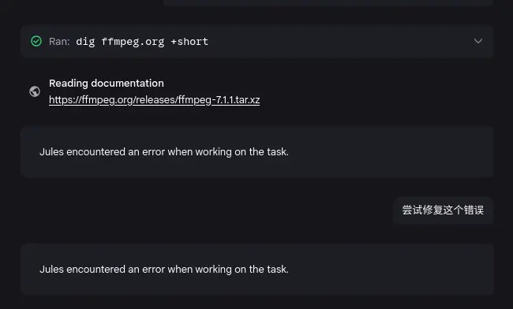
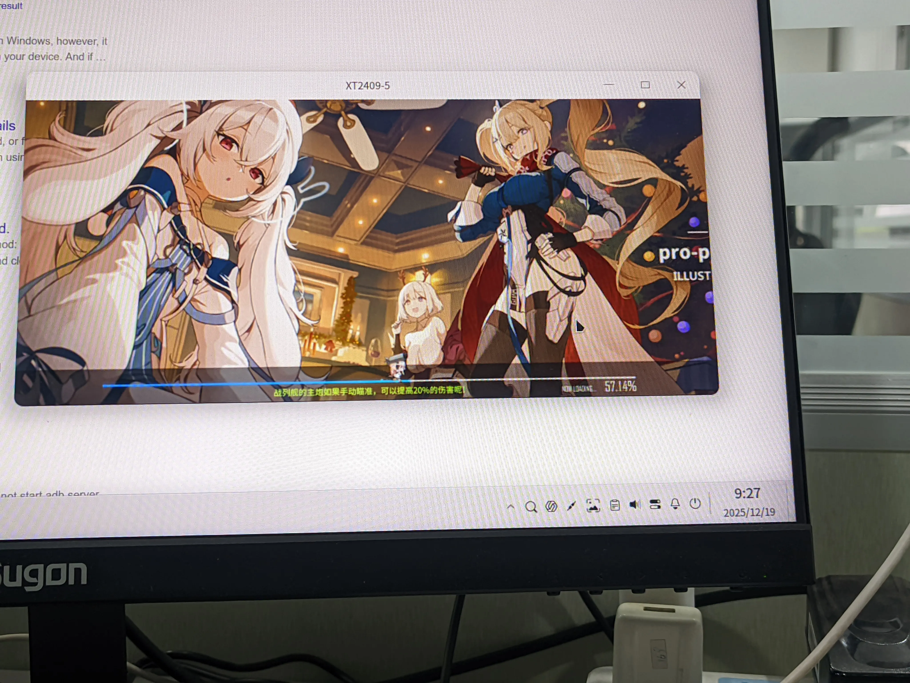
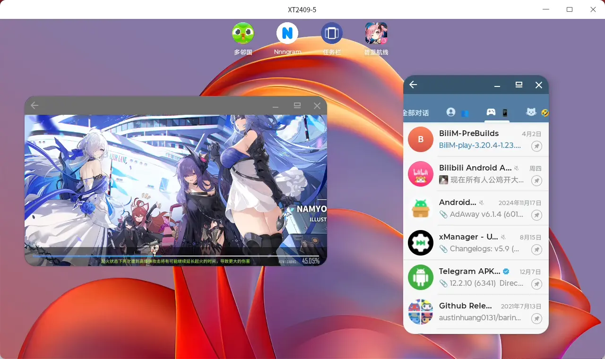

谁能想到我都跑到 Arch 了还能被依赖问题追上呢（但这次和 Arch 无关
另外直接 LLM Agent Vibe Coding 确实有点意思。

<!--more-->

## 一些依赖问题

虽然我自己用上 Arch Linux 了，但是遗憾的是我不能把我接触到的每个设备都变成 Arch，或者说版本足够新的其他发行版。  

比如平常就会碰到 4.19 内核的设备。（而我现在的内核版本是 6.18.2，令人感叹）  

问题就出在了这里：这个设备的 glibc 版本是 2.28，低于 Scrcpy 的要求，于是无法运行。  

## 解决思路

Scrcpy 是开源项目，也就意味着可以自己编译二进制：手动设置环境的 glibc 版本 2.28。项目内就有现成的 github actions workflow，理论上把环境一改就完事了。  

**但我太懒了。**  
当然了现在 Actions 里支持的最旧的版本也不支持 glibc 2.28 了。  

同时我手边有没有一个有合适环境的电脑，于是目光转向了一个之前一直没有正经接触的东西：LLM Coding Agent!  

## Jules！

当我兴冲冲的打开 Github 副驾驶准备给出来命令让他一通改的时候，才发现免费用户不能使用 Agent 模式。  

本来我都打算打开 Termux 安装 Gemini Cli 一把梭了。但是突然想起来 Google 是不是有个专门用来编程的 Agent 来着，一搜想起来了：[Jules](https://jules.google/)。  

Jules 有这样几种模式（由 Gemini 3 总结）：  

| 模式名称 | 功能描述 | 交互特点 |
| :--- | :--- | :--- |
| **Scheduled task** (NEW!) | 在你不在时为 Jules 创建工作任务 | 异步执行，无需实时守候 |
| **Interactive plan** | 在规划和批准前，通过对话了解目标 | 深度沟通，确保理解一致 |
| **Review** | 生成计划并等待用户批准 | 先看方案，确认后再动手 |
| **Start** | 无需计划批准，直接开始执行 | 效率优先，快速进入工作状态 |

我想着并非复杂东西，直接 `Start` 走起。

### 好用，但需要习惯

关联上项目，然后给出了以下的提示词：  

> 修改 github action workflow，使编译结果仅包含 Linux x64 可执行文件，同时应该支持 glibc 2.28 版本

Jules 非常标准的 fork 新分支、修改 workflow、commit、创建 PR。然后整个流程迎来它最薄弱的一环：我。  

我看着可以啊就直接合并了，然后问题来了：Workflow 一跑报错了，整蛊的是虽然有问题但是他报错的地方不是问题所在。

```bash
wget https://ffmpeg.org/releases/ffmpeg-7.1.1.tar.xz -O ffmpeg-7.1.1.tar.xz ffmpeg-7.1.1.tar.xz: not found, downloading... --2025-12-18 09:13:08-- https://ffmpeg.org/releases/ffmpeg-7.1.1.tar.xz Resolving ffmpeg.org (ffmpeg.org)... failed: No address associated with hostname. wget: unable to resolve host address 'ffmpeg.org' Error: Process completed with exit code 4.
```

我以为是 Jules 用了什么邪门硬编码于是打算丢给 Jules 但是遇上了更多的问题：
1. Jules 告诉我他干完了可以 `View PR`。但实际上 PR 已经被我合并了，而且原本的分支上也没有新的 commit。
2. 它罢工了。
    

好在这里我想起来重新跑了一遍 Action 暴露了真正的问题，然后打开了一个新的 session，完美解决！  

虽然还是有个小插曲：手贱把对应的 PR 关掉了重新开了个 PR。不过这里也感觉有些时候 Jules 的理解也不太对，比如我懒得复制完成的分支名称，直接简称了说你把这个分支合并进主分支，但是 Jules 理解成了你提 PR 的分支就一定要是这个名称，于是多了一个分支。但是无伤大雅就是了。  

## Taskbar

到这里其实最关键的部分就完成了：我现在可以使用 Scrcpy 在电脑上投屏手机内容了。  



不过我正好装着 [Taskbar]()，本来用来小窗启动应用的，但是它还有一个功能：「桌面模式」，即在外屏上窗口化启动应用的类 Dex 模式。  

|:--:|:--:|
|||

然后我才发现原来还有「首要启动器」这个选项：把 Taskbar 设置为默认主屏幕应用之后仍然可以将系统的默认桌面作为竖屏下的启动器，即所谓的首要启动器。不过似乎我的 Moto 上启用这个选项之后系统自带桌面会卡的出奇不提。  

然后有了这个之后直接 `scrcpy --new-display=/120` 就可以得到一个 Android 桌面了！。  
感谢 Taskbar。  


